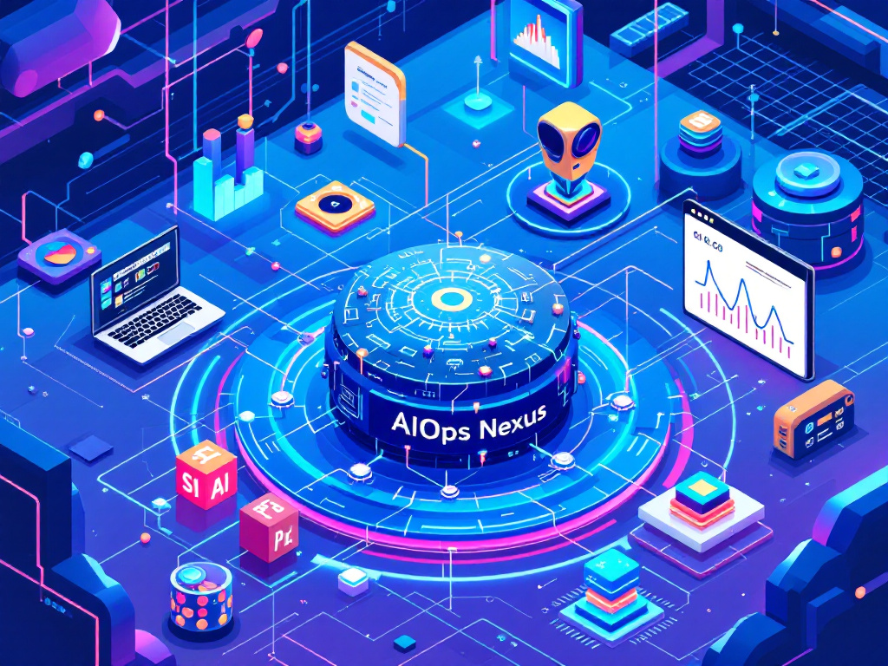

# AIOps Nexus

<p align="center">
  
<p/>

<h4 align="center">Best practices to gain maximum engagements, contributions, and acknowledgements(like stars, sponsors)</h4>

<p align="center">
<a href="https://github.com/techednelson/aiops-nexus/blob/master/LICENSE" target="blank">

</a>
<a href="https://github.com/techednelson/aiops-nexus/fork" target="blank">

</a>
<a href="https://github.com/techednelson/aiops-nexus/stargazers" target="blank">

</a>
<a href="https://github.com/techednelson/aiops-nexus/issues" target="blank">

</a>
<a href="https://github.com/techednelson/aiops-nexus/pulls" target="blank">

</a>

<p align="center">
    <a href="https://github.com/techednelson/aiops-nexus/issues/new?template=bug_report.md">Report Bug</a>
    ·
    <a href="https://github.com/techednelson/aiops-nexus/issues/new?template=feature_request.md">Request Feature</a>
</p>

# 👋 Introducing `AIOps Nexus`

`AIOps Nexus` is an open-source, **dockerized application** that simplifies IT operations by analyzing logs from monitoring tools like **OpenSearch**, **Elasticsearch**, **Alertmanager**, **Prometheus**, and more. It uses free, **open-source LLMs** to identify root causes and generate actionable solutions, delivering them via webhooks to platforms like Slack and Discord.

Deployable within corporate infrastructure (e.g., inside a VPN) or on cloud VMs with controlled access, `AIOps Nexus` ensures data security by avoiding internet exposure. It is ideal for organizations prioritizing privacy while leveraging AI to enhance operational efficiency at minimal costs, limited to the hardware or VM where it is deployed.

# 🔥 Key Features

- ✨ **[Dynamic LLM Selection](https://ollama.com/search)**: Choose from various **open-source LLMs** (e.g., [Llama3](https://ai.meta.com/blog/meta-llama-3/), [Mistral](https://mistral.ai/en), [DeepSeek-R1](https://www.deepseek.com/), and more via Ollama) to meet specific user needs.
- 🆓 **Free and Open Source**: Utilize completely free, **open-source LLM** models without incurring API costs—your only expense is the hardware or VM where the app is deployed.
- 📈 **Log Analysis**: Automatically analyze logs from monitoring tools to identify root causes of incidents.
- 🎬 **Actionable Solutions**: Generate and deliver solutions via webhooks to platforms like Slack and Discord for team awareness and collaboration.
- 🧠 **Caching Mechanism**: Optimize performance by caching repeated queries for faster responses.

# 🔑 Why Use `AIOps Nexus`?

`AIOps Nexus` enables companies and users to integrate AI into their operations effortlessly, supporting incident resolution and operational efficiency at no additional cost beyond infrastructure. By combining cutting-edge AI with a user-friendly interface, this project empowers teams to focus on solving problems rather than managing tools.

# 🏁 To start using `AIOps Nexus`

First [Install Docker Desktop](https://docs.docker.com/compose/install/) if you don't have installed it yet.

### Docker
**Ideal for fast deployment and local testing.**
```
docker run --name aiops-nexus LLM=llama3.2 -p 5000:5000 webtechnelson/aiops-nexus:1.1.0
```
Test `AIOps Nexus` api with:
```
curl -X POST http://localhost:5000/api/alert \
-H "Content-Type: application/json" \
-d '{"ERROR": "10.185.248.71 - - [09/Jan/2015:19:12:06 +0000] 808840 \"GET inventoryService/inventory/purchaseItem? userId=20253471&itemId=23434300 HTTP/1.1\" 500 17 \"-\" \"Apache-HttpClient/4.2.6 (java 1.5)\""}'

```
> 💡 **Important Notes**
>
> The `aiops-nexus` Docker image comes with the pre-installed [llama3.2(3B)](https://ollama.com/library/llama3.2) model, allowing quick startup with minimal hardware (**2 CPUs** and **4GB RAM**). Setting the `LLM` environment variable to a different model will download it on startup, which may take time and require more resources.
>
> For larger models according to [ollama reference](https://github.com/ollama/ollama#model-library):
>- **7B**: At least 8GB RAM
>- **13B**: At least 16GB RAM
>- **33B**: At least 32GB RAM 
### Docker Compose (Integration with Open-Webui)
**Ideal for quick deployment on Cloud VMs with controlled access or VMs in a corporate envinment within a VPN. Perfect for companies looking to keep prompts and GPT responses secure without internet exposure. Use it for AIOps log analysis or interact directly with Ollama LLMs through a user-friendly Open-WebUI for technical consultations.**
```
services:
  aiops-nexus:
    container_name: aiops-nexus
    image: webtechnelson/aiops-nexus:1.1.0
    working_dir: /aiops-nexus
    environment:
      DEBUG: 1
      WEBHOOK_URL: https://hooks.slack.com/services/xxxxxxxxxxxxxxxxxxxxxxxxxxxxxxxxxxxx # slack and discord are compatible at this moment
      LLM: llama3.2 # if LLM is left blank, pre-installed llama3.2 will be loaded
    volumes:
      - ./app:/aiops-nexus/app
    ports:
      - "5000:5000"
      - "11434"
    restart: on-failure
  open-webui:
    container_name: open-webui
    image: ghcr.io/open-webui/open-webui:main
    environment:
      - OLLAMA_BASE_URL=http://aiops-nexus:11434
    volumes:
      - open-webui:/app/backend/data
    ports:
      - "3000:8080"
    restart: always

volumes:
  open-webui:
```
Test `AIOps Nexus` api with:
```
curl -X POST http://localhost:5000/api/alert \
-H "Content-Type: application/json" \
-d '{"ERROR": "10.185.248.71 - - [09/Jan/2015:19:12:06 +0000] 808840 \"GET inventoryService/inventory/purchaseItem? userId=20253471&itemId=23434300 HTTP/1.1\" 500 17 \"-\" \"Apache-HttpClient/4.2.6 (java 1.5)\""}'

```

Access Open-WebUI at [http://localhost:3000](http://localhost:3000).

- Enter any value in `Full Name`, `Email`, and `Password` fields to sign up.

# 🚧 To start developing `AIOps Nexus`

1. Install docker desktop (skip if you already have it installed):

[Install Docker Desktop](https://docs.docker.com/compose/install/)

2. Clone the repository:

```bash
git clone https://github.com/techednelson/aiops-nexus
```

3. Change the working directory:

```bash
cd aiops-nexus
```

4. Run the app

```bash
docker compose up # or, docker compose up -d to avoid logs
```

That's All!!!

- Access Open-WebUI at [http://localhost:3000](http://localhost:3000).

Enter any value in `Full Name`, `Email`, and `Password` fields to sign up.

- Interact with `AIOps Nexus` api at http://localhost:5000/api/alert

```
curl -X POST http://localhost:5000/api/alert \
-H "Content-Type: application/json" \
-d '{"ERROR": "10.185.248.71 - - [09/Jan/2015:19:12:06 +0000] 808840 \"GET inventoryService/inventory/purchaseItem? userId=20253471&itemId=23434300 HTTP/1.1\" 500 17 \"-\" \"Apache-HttpClient/4.2.6 (java 1.5)\""}'

```

# 📖 Nexus AIOps Integration: Proven Examples for Seamless Operations

### OpenSearch and Slack (Kubernetes Setup)

🚧 `Under construction`

- Follow detailed instructions here: [`examples/opensearch/README.md`](./examples/opensearch/README.md)

### Integration withElasticsearch and Discord (Docker Compose Setup)

🚧 `Comming Soon...`

- Follow detailed instructions here: [`examples/elasticsearch/README.md`](./examples/elasticsearch/README.md)

# 🍔 Built With
- [Python](https://www.python.org)
- [Fastapi](https://fastapi.tiangolo.com)
- [poetry](https://python-poetry.org)
- [Docker](https://www.docker.com)
- [Ollama](https://ollama.com)
- [Langchain](https://python-poetry.org/)
- [Open-Webui](https://docs.openwebui.com)

# 🛡️ License
This project is licensed under the MIT License - see the [`LICENSE`](LICENSE) file for details.

# 🦄 Upcoming Features
`AIOps Nexus` has all the potentials to grow further. Here are some of the posible upcoming features planned(not in any order),

- ✔️ Replace InMemory cache for redis.
- ✔️ Incorporate embeddings in some way.
- ✔️ Add realtime processing pipelines with kafka.
- ✔️ Add support for Teams webhooks.

If you find something is missing, `AIOps Nexus` is listening. Please create a feature request [from here](https://github.com/techednelson/aiops-nexus/issues/new?template=feature_request.md).

# 🤝 Contributing to `AIOps Nexus`
Any kind of positive contribution is welcome! Please help us to grow by contributing to the project.

If you wish to contribute, you can work on any features [listed here](https://github.com/techednelson/aiops-nexus#-upcoming-features) or create one on your own. After adding your code, please send us a Pull Request.

> Please read [`CONTRIBUTING`](CONTRIBUTING.md) for details on our [`CODE OF CONDUCT`](CODE_OF_CONDUCT.md), and the process for submitting pull requests to us.

# 🙏 Support

We all need support and motivation. `AIOps Nexus` is not an exception. If you found this app helpful, consider supporting us with a ⭐️.


